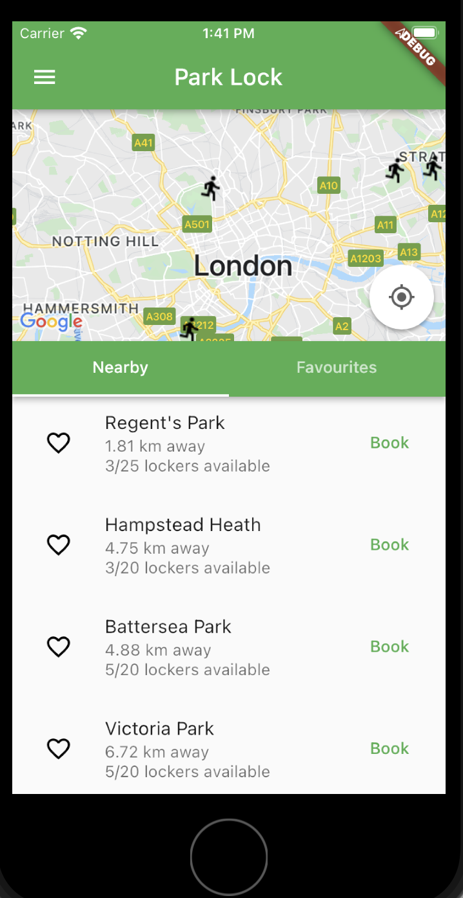

# ParkLock

ParkLock is developing and deploying smart lockers for runners in parks that can be booked and unlocked with a mobile phone. This app serves as an MVP for the locker booking app.

## Highlights

- Shows a map centred on London visualising (potential future) sites of ParkLock's smart lockers, with address and availability visible on click of each icon.
- Map uses user location to make it easier to see the direction of the nearest locker.
- Provides two tabs for browsing lockers, "Nearby" and "Favourites".
- "Nearby" shows all lockers sorted by "as the crow flies" distance from a user's location (note: it is currently expected that the user is at 90 Tottenham Court Rd when using the app).
- "Favourites" shows all lockers which have been favourited, again sorted by distance.
- Each locker can be bookable for one credit via the Book button on the side of each locker, if it has availability.
- Credits can be purchased from the sidebar, accessible via the drawer icon; for testing purposes, 5 free credits can be attained with the "Get 5 free credits button".
- If out of credits, you will be given a dialog to alert the user that they will need to buy more credits to use a locker.
- The "Book" buttons will be switched to "Full" when all lockers at a location are booked.

    

## Include A Section That Tells Developers How To Install The App

While multi-platform functionality is likely straightforward to implement, this app has only been tested with iOS.

- To run the app on iOS, you will need to create an `AppDelegate.swift` file in `ios/Runner/` copied from `AppDelegate.swift` (found at the root of the repository hierarchy)
- Copy a Google Maps API Key. An API Key can be obtained from [Google's developer portal website](https://developers.google.com/maps/documentation/ios-sdk/get-api-key).
- Paste the API key into `AppDelegate.swift` in the following line: `GMSServices.provideAPIKey("Insert Google Maps API key here")`

## Contact Details

If you have any questions about the workings of this app, please publish an issue in this repository.
